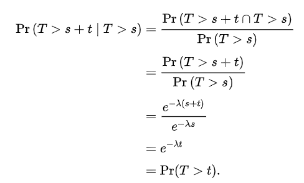

seir 

Mình phải tạo note này vì mình không nắm được ý generalize của a H.

Giờ nhé theo sir cũ là mỗi ngày đều có người die. Ảnh nói nó là theo exp dist. Exp dist ở chỗ là không memoryless nên mỗi ngày xác suất chết như nhau. Mình không nhớ exp dist lẫn memoryless, rốt cục nó là gì.

Memoryless

> if an event has not occurred after 30 seconds, the [conditional probability](https://en.wikipedia.org/wiki/Conditional_probability) that occurrence will take at least 10 more seconds is equal to the unconditional probability of observing the event more than 10 seconds after the initial time.

Hmmm, mình nghĩ mình hiểu gì đó rồi. Anh H kêu là nó cứng mỗi ngày nên sẽ delay nó bằng neg bin. Nếu nhìn vào tính chất memless thì mình hiểu là những case chết hôm đó sẽ không phụ thuộc những ngày trước bị fail. Nhìn lại ứng dụng của Exp dist: 

> **To predict the amount of waiting time until the next event (i.e., success, failure, arrival, etc.).**

Có một dist cũng khá tương tự:

>  **to predict the probability of a given number of events** occurring in a fixed interval of time.

Đây là Poisson Dist. 

Nó hơi ngược nhau đúng không, Poisson là đi nói số lượng ev trong 1 interval, còn Exp là đi nói chờ bao nhiêu để xảy ra 1 ev.

Exp($\lambda$) Pois($\lambda$) thì $\lambda$ này y như nhau, là event rate, đều là trung bình số event của interval. Nhưng cách interpret khác và công thức khác. Chỉ cần nhớ $\lambda$ là rate, là số event / 1 unit time, thì khi đi lấy 1/ $\lambda$ nó sẽ ra số thời gian tới 1 unit event. Chỉ vậy thôi.

Ok quay lại nào, tại sao neg bin là generalize của exp. Thực ra ảnh cũng đính chính gamma mới là generalize, và neg bin chỉ là phiên bản discrete của Gamma dist. 

So sánh ứng dụng Negative Binary Dist và Gamma Dist

>  The exponential distribution predicts the wait time until the **very first** event. The **gamma distribution**, on the other hand, predicts the wait time until the **k-th** event occurs.

> **Negative Binomial Dist**: number of failures in a sequence of independent and identically distributed [Bernoulli trials](https://en.wikipedia.org/wiki/Bernoulli_trial) before a specified (non-random) number of successes (denoted *r*) occurs

Điểm khác biệt duy nhất: 1 cái là wait time, 1 cái là số lần failure. Ok cho nên anh Hy mới đặt nickname là ver discrete. :smiley: 

Vậy là fill xong cái gasp intuition. 

Giờ đi tiếp tới việc formulate. Mình có xác suất death mỗi unit time là $\alpha$ , và mỗi ngày đều có death với xác suất đó. 

> đại loại e sẽ có 1 cái P(chết sau k ngày). 
>
> kiểu số ca death sẽ = tổng theo k ( số ca bị k ngày trước * xác suất chết trong k ngày)

Câu hỏi: 

- giới hạn max k là tới đâu 
- xác suất chết trong k ngày có bằng P(chết sau k ngày)
- nếu đúng thì nó là sample từ neg bin nhỉ ? Nếu sample thì tham số r, p lấy đâu ra. Học p từ số fix r ? Hơi khó hình dung

Đoán:

- max k thì chạy về ngày đầu tiên. Nhưng mà bởi vì ý a Hy là tham số đến từ average từng người, trong khi ảnh lấy ý tưởng theo dõi từng người, thế thì làm sao biết được số người của ngày đầu còn bn nhiều mà lấy xác suất, lỡ nó còn 0 thì xác suất nó cũng ảnh hưởng những ngày phía sau do công thức chỉ đơn giản là `số ca bị k ngày trước * xác suất chết trong k ngày`, trừ khi ý ảnh là ... À khoan hiểu. Vậy là k-th ngày trước nhỉ, chính tại ngày đó thì nó không ảnh hưởng.  Mình cần quay lại coi neg bin tính thế nào để confirm. À khoan có gì mà confirm nhỉ, chỉ là P * #case thôi mà :v 
- Giống, chỉ thế mới make sense

Rep: 

- inf 
- Không, vậy mình hiểu sai. Không, mình hiểu sai ra cách đúng. xác suất chết trong k ngày hiểu đúng là P <= k, nhưng nó không hợp lý. Cái đúng là số ca bị k ngày trước * P( x==k) , tức P(chết sau k ngày (kể từ $t_0$))
- fit cả 2, không hình dung được thuật toán sẽ fit như nào. 

